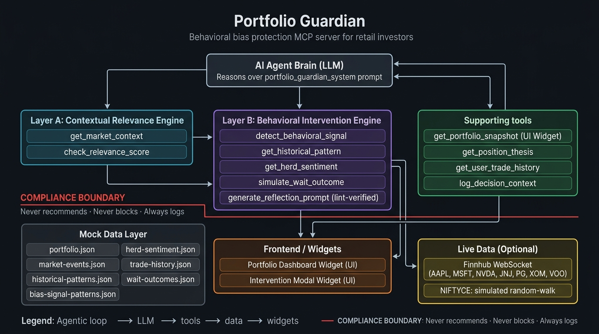
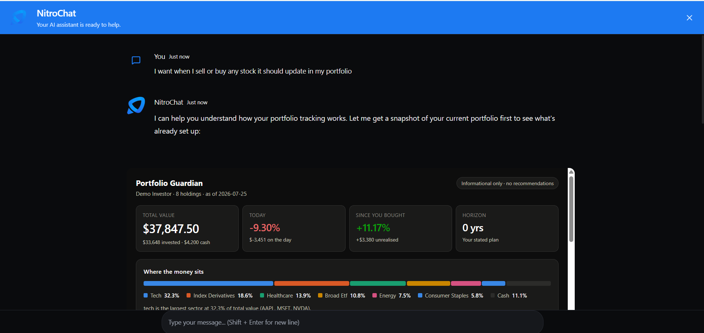
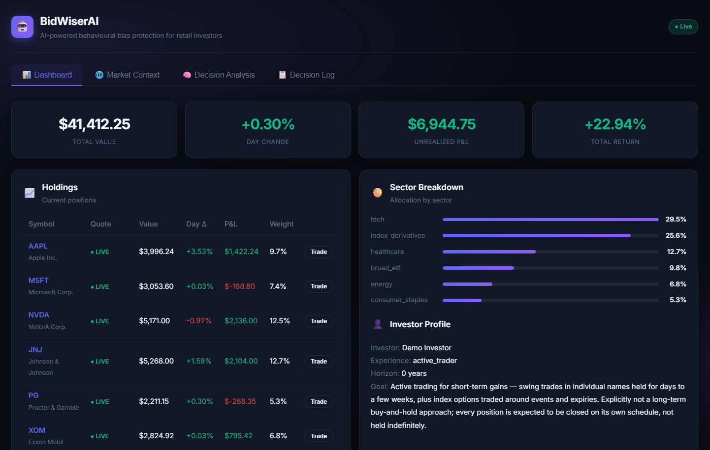
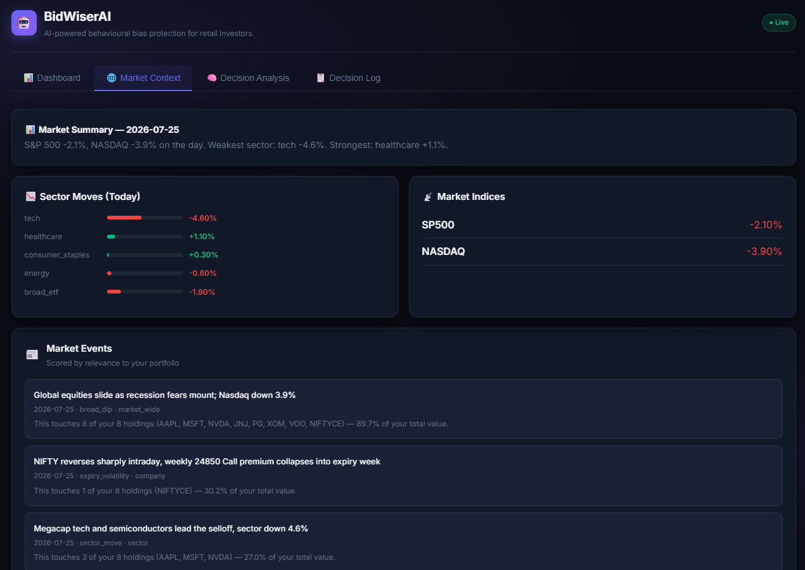
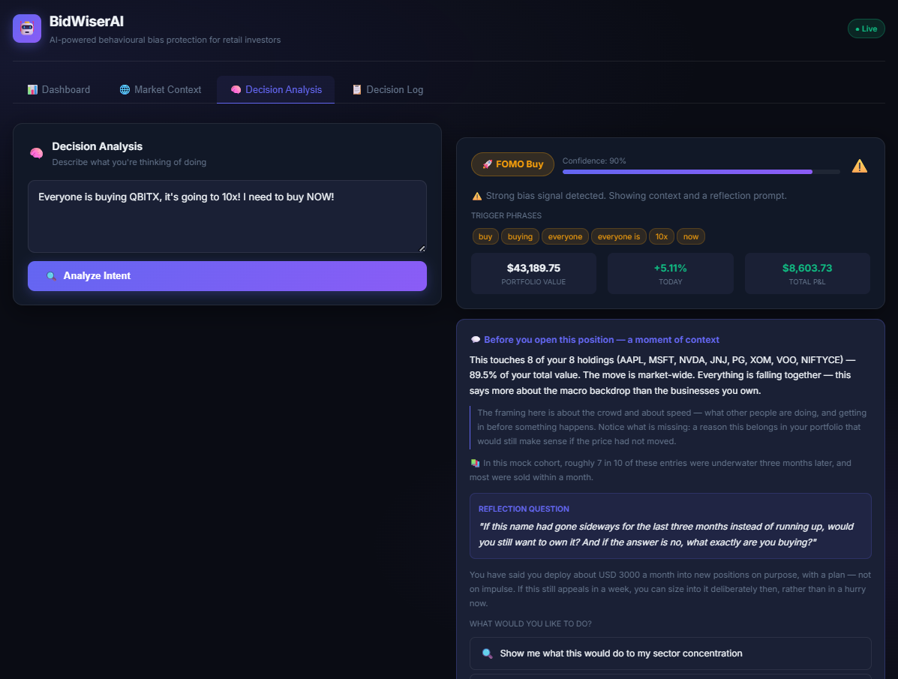
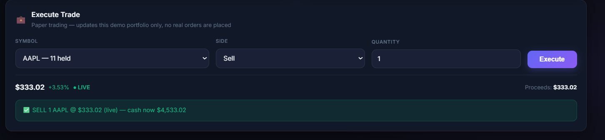

# BidWiserAI

**A behavioural guard for retail investors, built as a NitroStack MCP server.**

> We don't tell you what to do. We stop you doing something you'll regret.

Retail investors have more market data than ever and nothing that explains what is actually relevant to *their* portfolio right now, or intervenes at the exact moment a bias is about to drive a bad decision. BidWiserAI does both — and it never recommends a trade.

## Live Demo

🚀 Live MCP endpoint: https://nitrochat-bidwi-agentic-alchemists-amrita-university-coimbatore.app.nitrocloud.ai/embed

🌐 Live Web App: https://bidwiserai-6a65-agentic-alchemists-amrita-university-coimbatore.app.nitrocloud.ai/

Point your MCP client at the endpoint above to try it instantly. Prefer a hosted setup? Deploy your own in minutes on Nitrostack.

---

## Tech Stack

| Layer | Technology |
| --- | --- |
| MCP Server Framework | [NitroStack](https://docs.nitrostack.ai) (`@nitrostack/core`) |
| Language | TypeScript 5 |
| Schema Validation | [Zod](https://zod.dev) |
| UI Widgets | Next.js (via `@nitrostack/widgets`) |
| Standalone Web App | Express + Vite |
| Live Market Data | [Finnhub](https://finnhub.io) WebSocket API |
| Transport | MCP stdio (dev) · HTTP + stdio dual (prod) |

## The Two Layers

**Layer A — Contextual Relevance Engine.** Most market news touches any given portfolio not at all.
BidWiserAI scores every event against the user's actual holdings: which positions, what percentage
of their money, and — critically — whether the move is market-wide, sector-level, or genuinely
specific to a company they own. That last distinction is what defuses most panic-sells.

**Layer B — Behavioural Intervention Engine.** When the user states an intent to trade, BidWiserAI
checks it against three bias patterns, then puts the context, the historical base rate, and one
reflective question in front of them *before* they act. They stay free to proceed. Proceeding is a
first-class button, not a grudging escape hatch.

---

## The Compliance Boundary

This is the design constraint the whole project is built around — not a disclaimer bolted on at the end:

| BidWiserAI does | BidWiserAI never does |
| --- | --- |
| Surfaces which holdings an event touches, and by how much | Says "buy", "sell", "hold", or "you should" |
| Names the bias pattern detected and the phrases that triggered it | Blocks or executes a trade |
| Shows what happened historically to people who decided this way | Predicts a price, a recovery, or a return |
| Asks exactly one reflective question, then stops | Assesses suitability or gives a financial plan |
| Logs everything shown, plus whatever the user chose | Overrides the user |

`generate_reflection_prompt` is the only tool that emits user-facing prose, and it **lints its own
output** against a list of banned directive phrases before returning. Every response carries the
compliance result — the intervention widget shows a "✓ No trade recommendation given" badge that is
computed, not decorative.

Two design details follow from the same principle:

- **The historical data includes counterweight cases** where the reactive decision turned out to be correct. Showing only the cases that support pausing would be advice wearing a costume.
- **Company-specific news is called out as such**, even though it makes selling look more reasonable. A guard that only ever argues for inaction is not a guard.

---

## The Three Bias Patterns

| Pattern | Fires on | What gets surfaced |
| --- | --- | --- |
| `panic_sell` | Sell intent + fear language + totality ("all", "everything") + urgency | Is this broad or company-specific? Recovery base rates; what past sellers locked in |
| `fomo_buy` | Buy intent + social proof + hype reference + fear of missing out | What this does to concentration; outcomes of past crowded entries |
| `herd_follow` | Trade intent justified by *someone else's* action, with no personal thesis | Their situation vs. yours; the lag between a signal and the price |

**Every pattern requires a trade-intent gate.** Emotional language alone can never fire an
intervention, and messages containing deliberation markers ("as planned", "rebalancing", "need the
cash for") are scored down. Informational questions cannot trigger anything at all.

That is the deliberate part: a missed nudge costs one decision, a false nudge costs the relationship.

---

## Architecture



```
my-mcp-server/
├── src/
│   ├── app.module.ts                      # Root NitroStack app module
│   ├── index.ts                           # Server entry point (stdio + HTTP transport)
│   ├── data/                              # Mock datasets (all figures fabricated, labelled)
│   │   ├── portfolio.json                 # 7 holdings, cost basis, the user's own thesis per position
│   │   ├── market-events.json             # Quotes, index/sector moves, 12 events (includes noise)
│   │   ├── historical-patterns.json       # Base rates per bias pattern, with counterweight cases
│   │   ├── bias-signal-patterns.json      # Phrase dictionary, weights, gates, thresholds, banned-advice list
│   │   ├── herd-sentiment.json            # 24-hour crowd order flow and fear/greed index
│   │   ├── trade-history.json             # User's own past bias events and outcomes
│   │   └── wait-outcomes.json             # Cohort outcomes for 24h / 7d / 30d wait periods
│   ├── modules/
│   │   └── guardian/
│   │       ├── guardian.module.ts         # NitroStack module registration
│   │       ├── guardian.store.ts          # Dataset loading + mutable decision log (rehydrates on boot)
│   │       ├── guardian.logic.ts          # Pure reasoning: valuation, relevance, detection, reflection, lint
│   │       ├── portfolio.tools.ts         # get_portfolio_snapshot, get_position_thesis
│   │       ├── market.tools.ts            # get_market_context, check_relevance_score       (Layer A)
│   │       ├── behavior.tools.ts          # detect_behavioral_signal … log_decision_context (Layer B)
│   │       ├── guardian.resources.ts      # 10 MCP resources incl. audit trail and operating rules
│   │       └── guardian.prompts.ts        # Agent system prompt + 3 reflection templates
│   ├── backend/
│   │   ├── api.ts                         # Express REST API + WebSocket relay (standalone web app)
│   │   ├── live-quotes.ts                 # Finnhub WebSocket client → scoped to held symbols only
│   │   └── portfolio-state.ts             # Persistent paper-trade state (rehydrates from disk)
│   ├── widgets/                           # NitroStack UI widgets (Next.js)
│   │   ├── app/
│   │   │   ├── portfolio-dashboard/       # Holdings, allocation, relevance-scored event feed
│   │   │   └── intervention-modal/        # Cooling-off screen with exposure bar + compliance badge
│   │   └── widget-manifest.json
│   └── health/                            # Health check endpoint
├── frontend/
│   └── index.html                         # Standalone single-file web demo (no build step)
├── docs/
│   ├── architecture.png                   # Architecture diagram
│   └── NitroChat.png                      # NitroChat demo screenshot
├── Images/
│   ├── HomePage.png                       # Web app home page screenshot
│   ├── DecisionAnalysis.png               # Decision analysis panel screenshot
│   ├── MarketContext.png                  # Market context panel screenshot
│   └── Execute.png                        # Paper trade execution screenshot
├── logs/
│   └── portfolio-state.json               # Paper-trade state (gitignored, survives restart)
├── dist/                                  # Compiled MCP server output
├── dist-backend/                          # Compiled Express backend output
├── scripts/
│   └── run-all-tests.ts                   # Integration test runner
├── .env.example                           # Environment variable template
├── package.json
├── tsconfig.json
└── tsconfig.backend.json
```

The reasoning logic (`guardian.logic.ts`) is deliberately kept pure and free of MCP concerns, so
relevance scoring and bias detection can be reasoned about — and tested — independently.

---

## Tools

| # | Tool | Layer | Purpose |
| --- | --- | --- | --- |
| 1 | `check_relevance_score` | A | Exposure %, affected holdings, and broad vs. sector vs. company-specific classification. Accepts ad-hoc headlines the user pastes in. |
| 2 | `detect_behavioral_signal` | B | Pattern, confidence, the exact phrases that matched, and an action band (`intervene` / `watch` / `none`). |
| 3 | `generate_reflection_prompt` | B | Composes the intervention and lints itself for directive language before returning. **Renders the intervention widget.** |
| 4 | `get_portfolio_snapshot` | Context | Holdings priced live: value, weights, sector breakdown, P&L, plus the relevance-scored event feed. **Renders the portfolio dashboard widget.** |
| 5 | `get_position_thesis` | Context | The reason the user *themselves* recorded for owning a position — the strongest material for any cooling-off question. |
| 6 | `get_market_context` | A | Index, sector and holding-level moves, plus the event feed. Establishes whether a move is market-wide, sector-level or single-stock. |
| 7 | `get_herd_sentiment` | B | 24-hour crowd order flow, mention volume, and the market-wide fear/greed index. Turns "everyone is selling" into a number. |
| 8 | `get_historical_pattern` | B | Base rates and comparable episodes, including counterweight cases where the reactive decision was correct. |
| 9 | `get_user_trade_history` | B | The user's own past bias events, how often they paused vs. proceeded, and how those calls turned out. Makes interventions personal. |
| 10 | `log_decision_context` | Audit | Records the full context shown and the decision made. Called after every intervention, including when the user proceeds anyway. |
| 11 | `simulate_wait_outcome` | B | Shows favourable AND unfavourable outcomes for a cohort that waited 24h / 7d / 30d. Never argues pausing is correct. |

---

## Resources

| Resource URI | Contents |
| --- | --- |
| `guardian://portfolio` | Raw portfolio holdings JSON |
| `guardian://portfolio/valued` | Holdings with live pricing applied |
| `guardian://market-events` | Current event feed and quotes |
| `guardian://historical-patterns` | Bias pattern base-rate datasets |
| `guardian://bias-signals` | Phrase dictionary and detection thresholds |
| `guardian://herd-sentiment` | Crowd order-flow and fear/greed data |
| `guardian://trade-history` | User's own past decision history |
| `guardian://wait-outcomes` | Cohort outcomes for wait periods |
| `guardian://decision-log` | Live audit trail of all interventions |
| `guardian://operating-rules` | BidWiserAI compliance constraints |

---

## Prompts

| Prompt | Purpose |
| --- | --- |
| `portfolio_guardian_system` | The agent's full operating instructions. **Load this first in NitroStudio.** |
| `bias_reflection_template` | Reflection templates for each of the three bias patterns. |
| `explain_relevance` | Plain-language relevance explanation template. |

---

## How the Agentic Loop Works

The tool-call sequence is **not hard-coded anywhere in this server**. The tools are the hands; the
model reasoning over `portfolio_guardian_system` is the brain deciding which hand to use and when.
Each tool returns a `next_step` field describing what it learned and what would sensibly follow, so
the model steers on results rather than a fixed script.

A typical chain for *"Market crashing, sell all my tech stocks now"*:

```
detect_behavioral_signal   panic_sell · confidence 0.92 · action: intervene
                           gate: sell intent ("sell") + emotional ("crashing")
                                 + totality ("all") + urgency ("now")
get_portfolio_snapshot     3 tech holdings = 39.2% of total value ($10,078)
get_market_context         NASDAQ -3.9%, tech -4.6% … but healthcare +1.1% and staples +0.3%
check_relevance_score      HIGH exposure, driver = sector, is_company_specific = FALSE
get_historical_pattern     comparable broad dips; ~2 in 3 sellers re-entered higher
generate_reflection_prompt "You wrote down a reason for each of these when you bought them —
                            AAPL: 'Wanted one large, cash-rich company I actually understand as
                            the anchor of the portfolio'. Has any of those reasons stopped being
                            true today, or has only the price changed?"
log_decision_context       DEC-0001 · full context + the user's choice
```

Nowhere in that output does BidWiserAI say *don't sell*. It reports facts, a base rate, and a question.

---

## NitroChat Demo

BidWiserAI integrates directly into NitroStudio's AI Chat. Load the `portfolio_guardian_system`
prompt and interact with the agent — it will reason over your holdings, detect bias patterns, and
surface reflective interventions entirely through tool calls, with no hard-coded script.



---

## App Screenshots

| Home Page | Market Context |
|---|---|
|  |  |

| Decision Analysis | Execute Trade |
|---|---|
|  |  |

---

## Real-Time Data and Paper Trading

The standalone web app (`src/backend` + `frontend/`) can run on live market data and lets you
execute trades against the demo portfolio.

**Live prices.** `src/backend/live-quotes.ts` opens a WebSocket to [Finnhub](https://finnhub.io)
for the portfolio's equity/ETF holdings (AAPL, MSFT, NVDA, JNJ, PG, XOM, VOO) and rebroadcasts
ticks to the browser over its own WebSocket at `/ws/live`. Deliberately scoped to symbols
actually held — not a general market-data platform. Set `FINNHUB_API_KEY` in `.env` (free, no card
required at [finnhub.io/register](https://finnhub.io/register)) — without it, everything falls back
to static mock quotes and says so in the server log and the dashboard's status badge.

**NIFTYCE is simulated, not real.** Real-time Indian F&O data (NSE options) needs a paid,
broker-linked feed (Kite Connect, Upstox, etc.) — there is no free equivalent to Finnhub for
Indian derivatives. NIFTYCE gets a local random-walk generator instead, clearly labelled
`simulated` everywhere it surfaces (API responses, the dashboard's quote badge). It behaves like a
live feed for demo purposes; it is not connected to any real market.

**Paper trading only.** `POST /api/execute-trade` adjusts the demo portfolio's holdings and cash
using the current live/mock price. Restricted to symbols already in the portfolio. **This never
touches a real brokerage** — no order routing, no account link, no real money. State persists to
`logs/portfolio-state.json` (gitignored) and the MCP server reads the same file, so a trade made
through the web app is visible in NitroStudio too.

---

## Quick Start

### Prerequisites

- Node.js ≥ 18
- [NitroStack CLI](https://docs.nitrostack.ai) (`npm i -g @nitrostack/cli`)
- Anthropic API key (or another LLM provider supported by NitroStack)

### Setup

```bash
# 1. Clone the repository
git clone https://github.com/NAMANRAO2/my-mcp-server.git
cd my-mcp-server

# 2. Install dependencies
npm install

# 3. Configure environment variables
cp .env.example .env
# Edit .env — at minimum, set ANTHROPIC_API_KEY
# Set FINNHUB_API_KEY for live prices (optional, degrades gracefully without it)

# 4. Start the MCP server (development)
npm run dev

# 5. (Optional) Start the widget dev server on :3001
npm run widget dev

# 6. (Optional) Start the standalone web app backend
npm run build:backend
npm start

# 7. (Optional) Open the standalone web demo
# Open frontend/index.html in a browser with the backend running on :3000
```

### Production Build

```bash
npm run build        # Compile server, bundle widgets, copy src/data into dist/
npm run start:prod   # Production mode (dual stdio + HTTP transport)
```

### NitroStudio

1. Open [NitroStudio](https://nitrostack.ai/studio) and connect to your running MCP server.
2. **Tools page** — run each tool individually and verify `Status: Success`.
3. **AI Chat** — load the `portfolio_guardian_system` prompt, then type one of the scenarios below.

---

## The Three Demo Scenarios

### Scenario 1 — Panic Sell

> "Market is crashing, sell all my tech stocks now"

`panic_sell`, confidence **0.92**, action **intervene**. BidWiserAI establishes that 39.2% of the
portfolio is exposed but the driver is *sector-level* — healthcare and staples are up on the same
day, so this is rotation rather than every asset falling at once. It quotes the user's own thesis
back at them and asks whether the reason changed or only the price.

### Scenario 2 — FOMO Buy

> "Everyone's buying QBITX, it's up 180% this month — I want in now before it's too late"

`fomo_buy`, confidence **0.90**, action **intervene**. BidWiserAI does not dismiss an unheld stock
as noise — it names the flags attached to the data (crowded trade, no earnings history, high
volatility), gives the base rate for late entries, includes the case where a crowded run-up kept
going, and asks: *"If this had gone sideways for three months instead, would you still want to own it?"*

### Scenario 3 — Herd Following

The one to test hardest. All of these return `none` or `watch`, and none may produce a modal:

| Message | Result | Why |
| --- | --- | --- |
| "How's my portfolio doing?" | `none` (0.00) | No trade intent — the gate never opens |
| "Why is my account down today?" | `none` (0.00) | Informational, however anxious it sounds |
| "Should I be worried about the tech dip?" | `none` (0.00) | A question, not an intent |
| "I want to sell 5 shares of XOM as planned to rebalance" | `none` (0.05) | Gate opens, then deliberation markers score it down |
| "sell all my tech stocks" | `watch` (0.52) | Totality without fear or urgency — surface context, don't run a full intervention |

The `watch` band exists precisely so borderline cases get a sentence rather than a modal.

---

## Environment Variables

| Variable | Required | Description |
| --- | --- | --- |
| `ANTHROPIC_API_KEY` | Yes | LLM provider API key |
| `PORT` | No | Express backend port (default: `3000`) |
| `MCP_SERVER_PORT` | No | MCP server port (default: `3001`) |
| `FINNHUB_API_KEY` | No | Free key from [finnhub.io/register](https://finnhub.io/register). Without it, quotes fall back to mock data gracefully. |
| `NITRO_LOG_LEVEL` | No | Log verbosity: `info` \| `debug` \| `warn` \| `error` |
| `NODE_ENV` | No | `development` (stdio transport) or `production` (dual transport) |
| `MCP_TRANSPORT_TYPE` | No | Override transport: `stdio` \| `http` \| `dual` |

